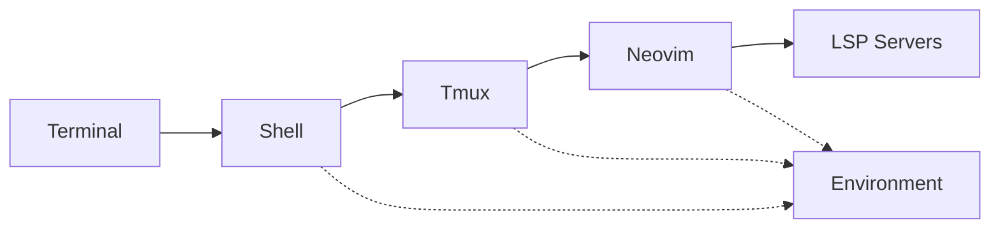

# Best Practices for Terminal Tool Harmonization

## Core Principles

### 1. Hierarchy of Control
Establish clear precedence for keybindings:
```
OS Level (Cmd+Alt)
    ↓
Terminal Multiplexer (Ctrl/Prefix)
    ↓
Application Level (Leader/Local)
    ↓
Insert Mode (Direct input)
```

### 2. Consistency Over Convenience
- Same action = Same key across tools
- Muscle memory > Optimal placement
- Predictability > Efficiency for rare operations

### 3. Progressive Disclosure
- Common operations: Direct keybindings
- Occasional operations: Leader/prefix combinations
- Rare operations: Command mode/palette

## Keybinding Best Practices

### Universal Navigation Pattern
```yaml
Navigation: Ctrl + hjkl
Resizing: Alt + hjkl
Movement: Alt + Shift + hjkl
Selection: Shift + hjkl
```

### Leader Key Selection
| Tool | Recommended Leader | Rationale |
|------|-------------------|-----------|
| Editor | Space | Thumb accessible, rarely typed |
| Tmux | Ctrl-b or Ctrl-a | Traditional, avoids conflicts |
| Shell | Ctrl-x | Available, memorable |
| Terminal | Ctrl-Shift | Distinguishes from app keys |

### Mnemonic Patterns
```lua
-- Group by function, not tool
<leader>f_  -- File operations
<leader>g_  -- Git operations
<leader>s_  -- Search operations
<leader>t_  -- Test/Terminal operations
<leader>w_  -- Window operations
```

## Theme Harmonization

### Single Source of Truth
```bash
~/.config/
├── theme/
│   ├── colors.env        # Environment variables
│   ├── colors.json       # JSON for tools that need it
│   └── generator.sh      # Generate tool-specific configs
```

### Color Accessibility
- Maintain WCAG AA contrast ratios (4.5:1)
- Test with color blindness simulators
- Provide light/dark mode variants

### Theme Variables Pattern
```bash
# Semantic naming over color names
THEME_BG_PRIMARY="#191724"      # Not THEME_BLACK
THEME_FG_PRIMARY="#e0def4"      # Not THEME_WHITE
THEME_ACCENT_PRIMARY="#c4a7e7"  # Not THEME_PURPLE
THEME_WARNING="#f6c177"         # Not THEME_YELLOW
THEME_ERROR="#eb6f92"           # Not THEME_RED
```

## Session/Project Management

### Project Detection Hierarchy
1. Git repository root (`.git`)
2. Package manifests (`package.json`, `Cargo.toml`, etc.)
3. Project markers (`.project`, `.root`)
4. Directory depth limit (stop at home)

### Session Naming Convention
```fish
# Consistent transformation
set session_name (echo $project_path | \
    sed "s|$HOME/||" | \    # Remove home path
    tr '/' '-' | \          # Replace slashes
    tr '.' '_')             # Replace dots
```

### Layout Templates
```lua
-- Per-project-type layouts
layouts = {
  javascript = { "editor", "terminal", "test" },
  rust = { "editor", "cargo-watch", "docs" },
  python = { "editor", "repl", "test" },
  default = { "editor", "terminal" }
}
```

## Performance Optimization

### Lazy Loading Strategy
```lua
-- Load order priority
1. Core (navigation, basic editing)     -- Immediate
2. Interface (statusline, colors)       -- <50ms
3. Enhancement (git, lsp)               -- <100ms
4. Optional (rarely used plugins)       -- On demand
```

### Startup Time Budgets
| Component | Target | Maximum |
|-----------|--------|---------|
| Shell | 30ms | 50ms |
| Terminal | 100ms | 200ms |
| Multiplexer | 20ms | 50ms |
| Editor | 100ms | 200ms |
| **Total** | **250ms** | **500ms** |

### Caching Strategies
```fish
# Cache expensive operations
set -U __git_prompt_cache_$PWD (git status --porcelain)
set -U __git_prompt_cache_time_(date +%s)

# Invalidate after timeout
if test (math (date +%s) - $__git_prompt_cache_time) -gt 5
    # Refresh cache
end
```

## Integration Patterns

### Tool Communication


### Shared State Management
```fish
# Use environment variables for shared state
set -gx CURRENT_PROJECT "$project_path"
set -gx ACTIVE_BRANCH (git branch --show-current)
set -gx VIRTUAL_ENV "$project_path/.venv"
```

### Event Propagation
```lua
-- Neovim autocmd for project changes
vim.api.nvim_create_autocmd("DirChanged", {
  callback = function()
    -- Update tmux window name
    vim.fn.system("tmux rename-window " .. vim.fn.fnamemodify(vim.fn.getcwd(), ":t"))
    -- Update environment
    vim.fn.setenv("CURRENT_PROJECT", vim.fn.getcwd())
  end,
})
```

## Documentation Standards

### Inline Documentation
```fish
function p --description "Unified project manager"
    # Usage: p [filter]
    # Opens fuzzy finder for project selection
    # Creates/attaches tmux session for selected project
    
    argparse h/help -- $argv
    or return
    
    if set -q _flag_help
        echo "Usage: p [filter]"
        echo "  Unified project manager"
        echo "Options:"
        echo "  -h, --help  Show this help"
        return 0
    end
    # ... implementation
end
```

### Keybinding Documentation
```lua
-- Consistent description format
vim.keymap.set("n", "<leader>ff", telescope.find_files, {
  desc = "[F]ind [F]iles",  -- Mnemonic hints
  silent = true,
})
```

### Which-Key Integration
```lua
require("which-key").register({
  ["<leader>"] = {
    f = { name = "+file" },
    g = { name = "+git" },
    s = { name = "+search" },
    t = { name = "+test/terminal" },
  }
})
```

## Testing and Validation

### Integration Tests
```fish
function test_navigation
    # Test cross-tool navigation
    tmux new-session -d -s test
    tmux send-keys -t test "nvim" Enter
    tmux split-window -t test -h
    
    # Send navigation commands
    tmux send-keys -t test C-l  # Should switch panes
    tmux send-keys -t test C-h  # Should switch back
    
    # Cleanup
    tmux kill-session -t test
end
```

### Performance Benchmarks
```bash
#!/bin/bash
# benchmark.sh

hyperfine --warmup 3 \
  'fish -c exit' \
  'zsh -c exit' \
  'nvim --headless +qa' \
  'tmux new-session -d \; kill-session'
```

### Compatibility Matrix
| Feature | macOS | Linux | WSL | SSH |
|---------|-------|-------|-----|-----|
| Smart Splits | ✅ | ✅ | ✅ | ✅ |
| System Clipboard | ✅ | ✅ | ⚠️ | OSC52 |
| True Color | ✅ | ✅ | ⚠️ | ✅ |
| Font Ligatures | ✅ | ✅ | ❌ | ❌ |

## Common Pitfalls and Solutions

### Pitfall 1: Overloading Keybindings
**Problem**: Too many keybindings to remember
**Solution**: Use command palettes for infrequent operations
```lua
-- Instead of binding everything
vim.keymap.set("n", "<leader>spt", search_project_todos)

-- Use command palette
:Telescope commands
-- Then search for "todos"
```

### Pitfall 2: Inconsistent Naming
**Problem**: `snake_case`, `kebab-case`, `camelCase` mixing
**Solution**: Establish naming conventions
```yaml
Files: kebab-case.ext
Functions: snake_case
Commands: PascalCase
Variables: snake_case
CSS/Classes: kebab-case
```

### Pitfall 3: Configuration Drift
**Problem**: Settings diverge over time
**Solution**: Version control with semantic commits
```bash
git commit -m "feat(nvim): add telescope-file-browser

- Replaces native netrw
- Adds file operations support
- Keybinding: <leader>fe"
```

### Pitfall 4: Breaking Changes
**Problem**: Updates break configuration
**Solution**: Pin versions and test updates
```lua
-- lazy.nvim example
{
  "nvim-telescope/telescope.nvim",
  tag = "0.1.5",  -- Pin to stable version
  -- or
  commit = "abc123",  -- Pin to specific commit
}
```

## Migration Strategies

### Gradual Migration
```fish
# Old command still works but shows deprecation
function old_command
    echo "Deprecated: use 'new_command' instead" >&2
    new_command $argv
end
```

### Feature Flags
```lua
-- Enable experimental features gradually
vim.g.experimental_features = {
  new_picker = false,  -- Use old picker
  smart_splits = true, -- Enable new navigation
}
```

### Rollback Capability
```bash
# Always maintain rollback path
alias config-backup='cp -r ~/.config ~/.config.backup.$(date +%Y%m%d)'
alias config-restore='cp -r ~/.config.backup.* ~/.config'
```

## Maintenance Practices

### Regular Audits
```bash
# Monthly checks
- [ ] Remove unused plugins
- [ ] Update deprecated configs
- [ ] Check for security updates
- [ ] Profile startup time
- [ ] Review keybinding conflicts
```

### Dependency Management
```toml
# Explicit dependency tracking
[dependencies]
neovim = ">=0.9.0"
tmux = ">=3.3"
fish = ">=3.6"
fd = "*"
ripgrep = "*"
fzf = ">=0.40"
```

### Documentation Updates
- Keep README current with setup instructions
- Document breaking changes
- Maintain changelog
- Include troubleshooting guide

## Advanced Patterns

### Contextual Keybindings
```lua
-- Different bindings based on filetype
vim.api.nvim_create_autocmd("FileType", {
  pattern = "rust",
  callback = function()
    vim.keymap.set("n", "<leader>cr", "<cmd>RustRun<cr>", { buffer = true })
  end,
})
```

### Dynamic Configuration
```fish
# Adjust based on environment
if test "$TERM_PROGRAM" = "WezTerm"
    set -gx TERM_FEATURES "hyperlinks,images"
else if test "$TERM_PROGRAM" = "ghostty"
    set -gx TERM_FEATURES "hyperlinks"
end
```

### Cross-Platform Adaptation
```lua
-- Platform-specific settings
if vim.fn.has("mac") == 1 then
  vim.opt.clipboard = "unnamedplus"
elseif vim.fn.has("unix") == 1 then
  vim.opt.clipboard = "unnamedplus,unnamed"
elseif vim.fn.has("win32") == 1 then
  vim.opt.clipboard = "unnamed"
end
```

## Resources and References

### Essential Reading
- [The Art of Unix Programming](http://www.catb.org/~esr/writings/taoup/)
- [Practical Vim](https://pragprog.com/titles/dnvim2/)
- [tmux 2: Productive Mouse-Free Development](https://pragprog.com/titles/bhtmux2/)

### Community Resources
- [r/neovim](https://reddit.com/r/neovim) - Neovim community
- [Awesome Dotfiles](https://github.com/webpro/awesome-dotfiles)
- [Dotfiles.github.io](https://dotfiles.github.io)

### Tools for Harmonization
- [Stow](https://www.gnu.org/software/stow/) - Symlink manager
- [Chezmoi](https://www.chezmoi.io) - Dotfile manager
- [Home Manager](https://github.com/nix-community/home-manager) - Nix-based config